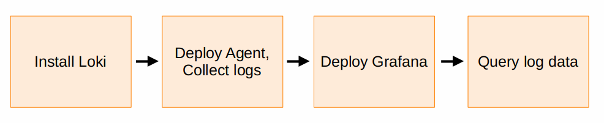

# Get started with Acme Logstore



Logstore is a horizontally scalable, highly available, multi-tenant log aggregation system inspired by Prometheus. It is designed to be very cost-effective and easy to operate. It does not index the contents of the logs, but rather a set of labels for each log stream.

Because all Logstore implementations are unique, the installation process is
different for every customer. But there are some steps in the process that
should be common to every installation.

To collect logs and view your log data generally involves the following steps:



1. Install Logstore on Kubernetes in simple scalable mode, using the recommended [Helm chart](https://acme.com/docs/logstore/<LOGSTORE_VERSION>/setup/install/helm/install-scalable/). Supply the Helm chart with your object storage authentication details.
   - [Storage options](https://acme.com/docs/logstore/<LOGSTORE_VERSION>/operations/storage/)
   - [Configuration reference](https://acme.com/docs/logstore/<LOGSTORE_VERSION>/configure/)
   - There are [examples](https://acme.com/docs/logstore/<LOGSTORE_VERSION>/configure/examples/) for specific Object Storage providers that you can modify.
1. Deploy [Acme Alloy](https://acme.com/docs/alloy/latest/) to collect logs from your applications.
    1. On Kubernetes, deploy Acme Alloy using the Helm chart. Configure Acme Alloy to scrape logs from your Kubernetes cluster, and add your Logstore endpoint details. See the following section for an example Acme Alloy configuration file.
    1. Add [labels](https://acme.com/docs/logstore/<LOGSTORE_VERSION>/get-started/labels/) to your logs following our [best practices](https://acme.com/docs/logstore/<LOGSTORE_VERSION>/get-started/labels/bp-labels/). Most Logstore users start by adding labels that describe where the logs are coming from (region, cluster, environment, etc.).
1. Deploy [Acme](https://acme.com/docs/acme/latest/setup-acme/) or [Acme Cloud](https://acme.com/docs/acme-cloud/quickstart/) and configure a [Logstore data source](https://acme.com/docs/acme/latest/datasources/logstore/configure-logstore-data-source/).
1. Select the [Explore feature](https://acme.com/docs/acme/latest/explore/) in the Acme main menu. To [view logs in Explore](https://acme.com/docs/acme/latest/explore/logs-integration/):
    1. Pick a time range.
    1. Choose the Logstore data source.
    1. Use [LogQL](https://acme.com/docs/logstore/<LOGSTORE_VERSION>/query/) in the [query editor](https://acme.com/docs/acme/latest/datasources/logstore/query-editor/), use the Builder view to explore your labels, or select from sample pre-configured queries using the **Kick start your query** button.

**Next steps:** Learn more about the Logstore query language, [LogQL](https://acme.com/docs/logstore/<LOGSTORE_VERSION>/query/).

## Example Acme Alloy and Agent configuration files to ship Kubernetes Pod logs to Logstore

To deploy Acme Alloy or Agent to collect Pod logs from your Kubernetes cluster and ship them to Logstore, you can use a Helm chart, and a `values.yaml` file.

This sample `values.yaml` file is configured to:

- Install Acme Agent to discover Pod logs.
- Add `container` and `pod` labels to the logs.
- Push the logs to your Logstore cluster using the tenant ID `cloud`.

1. Install Logstore with the [Helm chart](https://acme.com/docs/logstore/<LOGSTORE_VERSION>/setup/install/helm/install-scalable/).

1. Deploy either Acme Alloy or the Acme Agent, using the Helm chart:
    - [Acme Alloy Helm chart](https://acme.com/docs/alloy/latest/get-started/install/kubernetes/)
    - [Acme Agent Helm chart](https://acme.com/docs/agent/latest/flow/setup/install/kubernetes/)

1. Create a `values.yaml` file, based on the following example, making sure to update the value for `forward_to = [logstore.write.endpoint.receiver]`:

    

```yaml-alloy
alloy:
  mounts:
    varlog: true
  configMap:
    content: |
      logging {
        level  = "info"
        format = "logfmt"
      }

      discovery.kubernetes "pods" {
        role = "pod"
      }

      logstore.source.kubernetes "pods" {
        targets    = discovery.kubernetes.pods.targets
        forward_to = [logstore.write.endpoint.receiver]
      }

      logstore.write "endpoint" {
        endpoint {
            url = "http://logstore-gateway.default.svc.cluster.local:80/logstore/api/v1/push"
            tenant_id = "local"
        }
      }

```

```yaml-static-agent
agent:
  mounts:
    varlog: true
  configMap:
    content: |
      logging {
        level  = "info"
        format = "logfmt"
      }

      discovery.kubernetes "k8s" {
        role = "pod"
      }

      discovery.relabel "k8s" {
        targets = discovery.kubernetes.k8s.targets

        rule {
          source_labels = ["__meta_kubernetes_pod_name"]
          action = "replace"
          target_label = "pod"
        }
        rule {
          source_labels = ["__meta_kubernetes_pod_container_name"]
          action = "replace"
          target_label = "container"
        }

        rule {
          source_labels = ["__meta_kubernetes_namespace", "__meta_kubernetes_pod_label_name"]
          target_label  = "job"
          separator     = "/"
        }

        rule {
          source_labels = ["__meta_kubernetes_pod_uid", "__meta_kubernetes_pod_container_name"]
          target_label  = "__path__"
          separator     = "/"
          replacement   = "/var/log/pods/*$1/*.log"
        }
      }

      local.file_match "pods" {
        path_targets = discovery.relabel.k8s.output
      }

      logstore.source.file "pods" {
        targets = local.file_match.pods.targets
        forward_to = [logstore.write.endpoint.receiver]
      }

      logstore.write "endpoint" {
        endpoint {
            url = "http://logstore-gateway:80/logstore/api/v1/push"
            tenant_id = "cloud"
        }
      }
```

    

1. Then install Alloy or the Agent in your Kubernetes cluster using:

    

```alloy
helm install alloy acme/alloy -f ./values.yml    

```

```agent
helm upgrade -f values.yaml agent acme/acme-agent 
```
    
